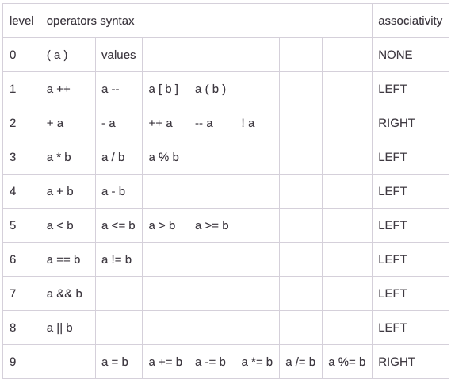

# TinyGo Language

Note: in Go '\n' = ';'

### Program

    SOURCEFILE := PACKAGE ";" { (DECLARATION | FUNCTION) ";" }
    PACKAGE := 'package' IDENTIFIER

### Identifier

    IDENTIFIER := LETTER {LETTER | DIGIT}

Some identifiers already occupied. Knows as keywords("for","else" etc)

### Number

    NUM := INT_NUM | DEC_FLOAT_NUM  
    
    INT_NUM := DEC_NUM | HEX_NUM | OCT_NUM | BIN_NUM
    DEC_NUM := "0" | ("1" .. "9") [ ["_"] DEC_DIGS ]
    HEX_NUM := "0" ("x" | "X") ["_"] HEX_DIGS
    OCT_NUM := "0" ("o" | "O") ["_"] OCT_DIGS
    BIN_NUM := "0" ("b" | "B") ["_"] BIN_DIGS

    DEC_DIGS := ("0" .. "9") {["_"] ("0" .. "9")}
    HEX_DIGS := ("0" .. "f") {["_"] ("0" .. "f")}
    OCT_DIGS := ("0" .. "7") {["_"] ("0" .. "7")}
    BIN_DIGS := ("0" | "1") {["_"] ("0" | "1")}

    DEC_FLOAT_NUM := DEC_DIGS "." [DEC_DIGS] 

### TYPES

    TYPE := TYPE_NAME | TYPE_LIT | "(" TYPE ")"
    TYPE_NAME := IDENTIFIER
    TYPE_LIT := BASE_TYPES | STRUCT_TYPE | POINTER_TYPE
    BASE_TYPES := "int8" | "int32" | "int" | "int64" | "float"
    
    STRUCT_TYPE := "struct" "{" {FIELD_OF_STRUCT ";"} "}"
    FIELD_OF_STRUCT := IDENTIFIER_LIST TYPE | TYPE_NAME  

    POINTER_TYPE := "*" TYPE

### Lists

    IDENTIFIER_LIST := IDENTIFIER {"," IDENTIFIER}
    EXPR_LIST := EXPR_STMT {"," EXPR_STMT}
    STATEMENT_LIST := {STATEMENT ";"}

    BLOCK:= "{" STATEMENT_LIST "}"

### Declaration

    DECLARATION := CONSTDECL | TYPEDECL | VARDECL

    CONSTDECL := "const" (CONSTPRIME | "("  {CONSTPRIME ";"} ")" )
    CONSTPRIME := IDENTIFIER_LIST [TYPE] "=" EXPR_LIST

    TYPEDECL := "type" (TYPEPRIME | "(" {TYPEPRIME ";"} ")")
    TYPEPRIME := IDENTIFIER ["="] Type

    VARDECL := "var" (VARPRIME | "(" {VARPRIME ";"} ")")
    VARPRIME := IDENTIFIER_LIST ( (TYPE [ "=" EXPR_LIST]) | "=" EXPR_LIST )

    SHORT_DECL := IDENTIFIER_LIST ":=" EXPR_LIST

### Function declaration

    FUNCTION := "func" IDENTIFIER SIGNATURE BLOCK
    
    SIGNATURE := PARAMETERS [RESULT]
    PARAMETERS := "(" [ PARAMETER_LIST ] ")"
    PARAMETER_LIST := PARAMDECL {"," PARAMDECL}
    PARAMDECL := [ IDENTIFIER_LIST ] ["..."] TYPE
    RESULT := PARAMETERS | TYPE

### Statement

    STATEMENT := DECLARATION | IF_STMT | SWITCH_STMT | FOR_STMT | "break" | "contunie" | RETURN_STMT | SIMPLE_STMT
    SIMPLE_STMT := SHORT_DECL | EXPR_STMT | EMPTY | ASSIGMENT

### If statement

    IF_STMT := "if" EXPR_STMT BLOCK ["else" (BLOCK | IF_STMT)]

### Switch statement

    SWITCH_STMT := "switch" [ SIMPLE_STMT ] "{" { CASE_CLAUSE } "}"
    CASE_CLAUSE := SWITCH_CASE ":" STATEMENT_LIST
    SWITCH_CASE := "case" EXPR_STMT | "default"

### For statement

    FOR_STMT := "for" [CONDITION | FOR_CLAUSE] BLOCK
    CONDITION := EXPR_STMT
    FOR_CLAUSE := [SIMPLE_STMT] ";" [EXPR_STMT] ";" [SIMPLE_STMT]

### Return statement

    RETURN_STMT := "return" EXPR_STMT

### Assigment

    ASSIGMENT := IDENTIFIER_LIST OP EXPR_LIST
    OP := ['+' | '-' | '*' | '/' | '%'] =

### Expressions

    

    EPSILON :=

    EXPR_STMT := E11
    
    E11 := E10 E11_PRIME
    E11_PRIME := "||" E10 E11_PRIME | EPSILON

    E10 := E11 E10_PRIME
    E10_PRIME := "&&" E11 E10_PRIME | EPSILON

    E9 := E8 E9_PRIME
    E9_PRIME := "|" E8 E9_PRIME | EPSILON

    E8 := E7 E8_PRIME
    E8_PRIME := "&" E7 E8_PRIME | EPSILON

    E7 := E6 E7_PRIME
    E7_PRIME := "==" E6 E7_PRIME | "!=" E6 E7_PRIME | EPSILON

    E6 := E5 E6_PRIME
    E6_PRIME := "<" E5 E6_PRIME | ">" E5 E6_PRIME | "=>" E5 E6_PRIME | "<=" E5 E6_PRIME | EPSILON

    E5 := E4 E5_PRIME
    E5_PRIME := "+" E4 E5_PRIME | "-" E4 E5_PRIME | EPSILON

    E4 := E3 E4_PRIME
    E4_PRIME := "*" E3 E4_PRIME | "/" E3 E4_PRIME | "%" E3 E4_PRIME | EPSILON

    E2 := "+" E2 | "-" E2 | "++" E2 | "--" E2 | "!" E2 | E1

    E1 := E0 E1_PRIME
    E1_PRIME := "++" E1_PRIME | "--" E1_PRIME | "(" EXPR_LIST ")" E1_PRIME | "." E1_PRIME | EPSILON
    
    E0 := "(" E11 ")" | NUM |  IDENTIFIER 

Main sources:
https://go.dev/ref/spec
https://courses.fit.cvut.cz/BI-PJP/@B222/materials/expressions.html
https://gitlab.fit.cvut.cz/NI-GEN/ni-gen-23/-/blob/main/LANGUAGE.md